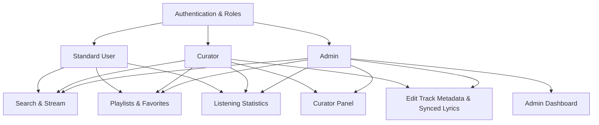

# Zephyr Frontend Migration & Feature Extension Plan

This document outlines the changes needed to migrate the Flutter frontend to support the new Zephyr Backend API features (v2). It introduces new user roles, curator operations, listening history analytics, advanced admin utilities, and local music catalog management.

---

## 📋 Architectural Overview of Changes

---

## 1. Authentication & Role-Based Access Control

### 🔄 Backend Changes
* `/api/auth/login` and `/api/auth/refresh` now return a `role` string: `"user" | "curator" | "admin"` (instead of the previous binary `is_admin` boolean).

### 🛠️ Frontend Updates
* **`AuthState` Model (`auth_provider.dart`)**:
  * Add a `String role` field (defaulting to `'user'`).
  * Add helper getters:
    * `bool get isAdmin => role == 'admin';`
    * `bool get isCurator => role == 'curator' || role == 'admin';`
* **`AuthNotifier` (`auth_provider.dart`)**:
  * Store and retrieve `zephyr_role` from `SharedPreferences`.
  * Support legacy fallbacks (e.g. if `zephyr_is_admin` is true, map role to `'admin'`).
* **Sidebar Navigation (`main_layout.dart`)**:
  * Conditionally display the **Curator Studio** item if `authState.isCurator` is true.
  * Conditionally display the **Admin Dashboard** item if `authState.isAdmin` is true.

---

## 2. Local-First Search Optimization

### 🔄 Backend Changes
* `/api/search` now runs **local-first** by default (returns matches from the local database instantly).
* If matches exist locally, it returns `has_remote: true`. The client can add `?remote=true` to force a YouTube Music lookup.

### 🛠️ Frontend Updates
* **Search View (`search_screen.dart`)**:
  * Parse `has_remote` from the search response.
  * If `has_remote == true`, display a subtle "Search on YouTube Music" discovery banner or button at the bottom of the local results.
  * Tapping the button re-triggers the search with `remote: true` to fetch remote catalog results.

---

## 3. Synced Lyrics & Track Metadata Editor (Curator Feature)

### 🔄 Backend Changes
* `PUT /api/curator/tracks/{track_id}`: Partially updates title, artists, album, plain lyrics (`lyrics`), and synced lyrics (`lyrics_lrc`).
* `POST /api/curator/tracks/{track_id}/cover`: Uploads/overwrites cover art image.
* `DELETE /api/admin/tracks/{track_id}`: Deletes a track, its metadata, files, and lyrics.
* `GET /api/artists/local`: Fetch list of all curator-created local artists.
* `GET /api/albums/local`: Fetch list of all curator-created local albums.

### 🛠️ Frontend Updates
* **Context Menus (`track_tile.dart` and detail screens)**:
  * If `authState.isCurator` is true, show an **"Edit Track Details"** option.
  * If `authState.isAdmin` is true, show a **"Delete Track from Server"** option (warning dialog first).
* **Metadata Editor Dialog (`track_metadata_editor_dialog.dart` - New Widget)**:
  * Create a popup form containing input fields:
    * Title (text field)
    * Artists: **Searchable dropdown/multi-select picker** limited only to existing local artists (fetched via `GET /api/artists/local`).
    * Album: **Dropdown picker** limited only to existing local albums (fetched via `GET /api/albums/local`).
  * Include a TabBar to edit **Plain Lyrics** (text area) and **Synced LRC Lyrics** (text area supporting synced timestamp formatting).
  * Feature an image upload widget to select and POST a new cover art file.

---

## 4. Curator Studio (New Section)

We will create a new screen [curator_screen.dart](file:///home/GioViale/Projects/Python/Zephyr/frontend/lib/screens/curator_screen.dart) only accessible to curators and admins. It will feature three management tabs:

### 📥 Tab 1: Upload Custom Audio
* **Purpose**: Allow curators to upload local audio files directly, bypassing YouTube downloads.
* **UI Controls**:
  * File picker button (supports MP3, M4A, FLAC, WAV, AAC).
  * Fields:
    * Title (text field)
    * Artists: **Searchable dropdown/multi-select picker** limited only to existing local artists.
    * Album: **Dropdown picker** limited only to existing local albums.
    * Duration in seconds (optional).
  * Progress indicator for uploads (`POST /api/curator/tracks/upload`).
  * On success, prompt the user with options to upload a Cover Art or add lyrics.

### 💿 Tab 2: Create Local Album
* **Purpose**: Group existing library tracks into a custom album profile.
* **UI Controls**:
  * Form fields: Album Title, Artist Names (searchable dropdown picker for existing local artists), Release Year.
  * Multi-select picker showing all locally downloaded tracks in the library, allowing the curator to order them.
  * Button to create the album (`POST /api/curator/albums`).
  * File uploader to assign cover art (`POST /api/curator/albums/{browse_id}/cover`).

### 👤 Tab 3: Create Local Artist
* **Purpose**: Manage custom artist profiles without YouTube Music bindings.
* **UI Controls**:
  * Form fields: Artist Name, Biography text.
  * Button to submit (`POST /api/curator/artists`).
  * Image picker to upload the artist avatar/banner (`POST /api/curator/artists/{artist_id}/cover`).

---

## 5. Listening Insights & Statistics (New Page)

We will create a new screen [statistics_screen.dart](file:///home/GioViale/Projects/Python/Zephyr/frontend/lib/screens/statistics_screen.dart) accessible to all users.

### 📊 Features & UI Components
* **Period Switcher**: Segmented buttons at the top:
  * `Last 30 Days` (API `1m`)
  * `Last 6 Months` (API `6m`)
  * `Last Year` (API `1y`)
  * `All Time` (API `all`)
* **KPI Cards**: Showcase metrics like **Total Listens** and **Unique Tracks** in prominent grids with sleek glow effects.
* **Top 10 Tracks & Top 10 Artists Lists**: Display rank-indexed lists of the most played songs and artists in the selected window.
* **Daily Activity Chart**: Build a custom-painted interactive bar chart that maps daily listening counts, styled to match the dark glassmorphic design theme.

---

## 6. Advanced Admin Utilities

We will upgrade the existing [admin_screen.dart](file:///home/GioViale/Projects/Python/Zephyr/frontend/lib/screens/admin_screen.dart) to expose new backend features:

### ⚙️ Enhancements
* **User Management**:
  * Display user roles (`user`, `curator`, `admin`).
  * Add a button to **Promote to Curator** (`POST /api/admin/curator/{username}`) for standard users.
* **System Stats Panel**:
  * Fetch and display metrics from `GET /api/admin/stats`:
    * Track Counts: Total, Completed, Pending, Failed.
    * Disk Usage: Audio size in MB, covers size in MB, paths.
  * Add a **"Retry Failed Downloads"** button that fires `POST /api/admin/retry-failed` and refreshes the stats.
* **Orphan File Scanner**:
  * Call `GET /api/admin/orphans`.
  * Display lists of:
    * DB Records missing physical files.
    * Stray files on disk missing database records.
  * Provide warning badges to help identify directory inconsistencies.

---

## 🚀 Step-by-Step Implementation Strategy

1. **Step 1: Core API & State Migration**
   * Update [auth_provider.dart](file:///home/GioViale/Projects/Python/Zephyr/frontend/lib/providers/auth_provider.dart) with new role getters and persistence.
   * Add new endpoints to [zephyr_api.dart](file:///home/GioViale/Projects/Python/Zephyr/frontend/lib/api/zephyr_api.dart).
2. **Step 2: Navigation & Search Adjustments**
   * Map new routes (`curator`, `statistics`) in [navigation_provider.dart](file:///home/GioViale/Projects/Python/Zephyr/frontend/lib/providers/navigation_provider.dart).
   * Update sidebar navigation in [main_layout.dart](file:///home/GioViale/Projects/Python/Zephyr/frontend/lib/screens/main_layout.dart) to show the new pages conditionally.
   * Integrate the "YouTube Fallback" toggle in [search_screen.dart](file:///home/GioViale/Projects/Python/Zephyr/frontend/lib/screens/search_screen.dart).
3. **Step 3: Build new Views**
   * Implement [statistics_screen.dart](file:///home/GioViale/Projects/Python/Zephyr/frontend/lib/screens/statistics_screen.dart).
   * Implement [curator_screen.dart](file:///home/GioViale/Projects/Python/Zephyr/frontend/lib/screens/curator_screen.dart).
   * Implement the track metadata modal.
4. **Step 4: Refactor Admin Screen**
   * Add stats, curators promotion, and retry buttons to [admin_screen.dart](file:///home/GioViale/Projects/Python/Zephyr/frontend/lib/screens/admin_screen.dart).
5. **Step 5: Verification & Quality Controls**
   * Run static analysis, test logins/role switching, and verify all uploads.
